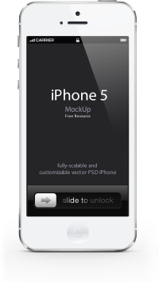

CSS 缩放器
=========================
什么是css缩放器？
> 其实就是针对背景图片进行缩放，因为是跟样式捆绑的，所以我们叫样式缩放器。

## 背景

主要针对无线端，目前无线端高清屏幕越来越多，为了让网页得到更好的用户体验，我们往往需要为高清
屏幕提供2倍大小的背景图片。

但是，有时候用户所在的网络环境不理想，加载非高清版本，能够让内容更快的呈现出来，
于是我们又需要提供一份非高清版本的样式，根据用户网络情况进行切换。

于是，我们需要维护两份相似度很高的样式表，这样便带来了一定的维护成本。

## 解决方案

> 如何解决样式表针对不同的终端带来的维护成本问题？
>> 默认只提供高清版本，普通版本自动生成如何？
>>> Excellent, 此程序就是用来实现此方案的。

## 如何使用？

* 安装npm包。

    ```bash
    npm install -g fis-prepackager-css-scale
    ```
* 配置`fis-conf.js`，对scale.css进行条件缩放。

    ```javascript
    // 启用此css-scale插件
    fis.config.set('modules.prepackager', fis.config.get('modules.prepackager') + ',css-scale');

    // 配置规则
    fis.config.set( 'settings.prepackager.css-scale', {
        include: /scale\.css$/i,
        condition: '$condition'
    });
    ```

## 配置说明

注意`settings.prepackager.css-scale`, 可以通过include, exclude来命中文件。
(支持正则，glob语法)，插件针对命中的文件进行自动做缩放。

### 命中css类文件

如果命中的是css类文件，所有对其的引用都会加上缩放并条件引用。

* link标签
  * 源码

    ```html
    ...
    <link rel="stylesheet" type="text/css" href="/static/css/scale.css">
    ...
    ```
  * 输出结果

    ```html
    ...
    <link rel="stylesheet" type="text/css" href="/static/test/css/scale.css"><link rel="stylesheet" type="text/css" href="/static/test/css/scale_0.5x.css">
    ...
    ```
* @import规则
  * 源码

    ```html
    ...
    <style type="text/css">
        @import url(/static/css/scale.css);

        /*其他样式*/
        .ruler {
            width: auto;
        }
    </style>
    ...
    ```
  * 输出结果

    ```html
    ...
    <style type="text/css">
        @import url(/static/test/css/scale.css);@import url(/static/test/css/scale_0.5x.css);

        /*其他样式*/
        .ruler {
            width: auto;
        }
    </style>
    ...
    ```
* [require](http://fis.baidu.com/userdoc/fis/%E6%8F%92%E4%BB%B6%E4%BD%BF%E7%94%A8#require) smarty插件
  * 源码

    ```html
    ...
    
    ...
    ```
  * 输出结果

    ```html
    ...
    
    ...
    ```
### 命中html类文件（包括tpl文件）
如果命中的是html类文件，此页面里面的所有内联style样式都会进行缩放，且对其的引用都会进行缩放并条件引用。

源码

```html
...
<style type="text/css">
.ruler {
    background: url(/static/test/images/iphone.png?xxx);
    -webkit-background-size: 508px 899px;
    -moz-background-size: 400px 500px;
}

.ruler {
    background: url(/static/test/images/iphone.png);
}</style>
...
```

输出结果

```html
<style type="text/css">
.ruler {
    background: url(/static/test/images/iphone.png?xxx);
    -webkit-background-size: 508px 899px;
    -moz-background-size: 400px 500px;
}

.ruler {
    background: url(/static/test/images/iphone.png);
}</style><style type="text/css">
.ruler {
    background: url(/static/test/images/iphone_0.5x.png?xxx);
    -moz-background-size: 400px 500px;
}

.ruler {
    background: url(/static/test/images/iphone_0.5x.png);
    background-size: 1017px 1798px;
}</style>
```

## 具体细节

针对高清屏幕的样式，我们往往会这么写。

```css
.ruler {
    background: url('xxx_200x200.png');
    background-size: 100px 100px;
}
```

把它转成普通版本的样式，需要两步。

1. 把图片`xxx_200x200.png`，通过`photoshop`缩小一倍， 变成`xxx_100x100.png`。
2. 去掉`background-size`一条。

最终变成。

```css
.ruler {
    background: url('xxx_100x100.png');
}
```

当然还有更多细节处理，这里不列出来！

## 担心图片自动缩放效果不好？

完全不用担心，效果与`photoshop`缩放的效果非常接近。

scale 0.2倍。

系统：
Photoshop: 

## 如果不想让某个背景图片自动缩放，怎么办？
默认样式表中所有图片，在此样式缩放的时候都会跟着缩放。如果某个图片不想被缩放，怎么办？

设置一个noScale属性就ok了。如下：

```css
.ruler {
    background: url(xxx.png?__noscale);
}
```